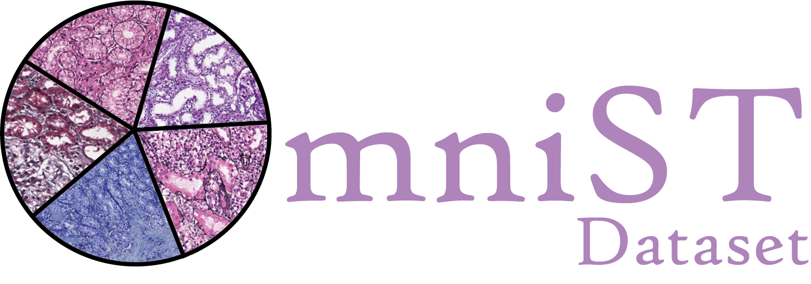
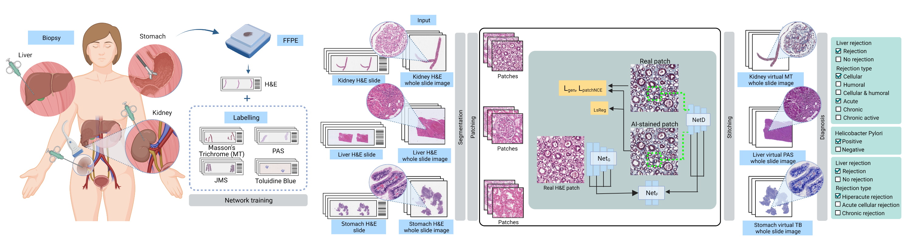
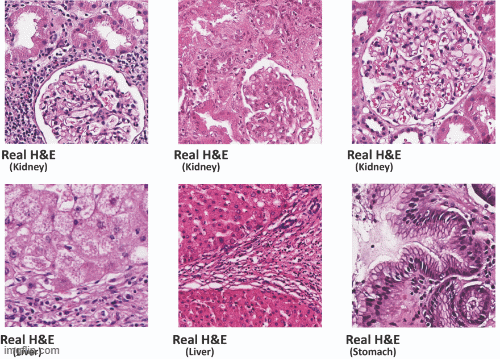
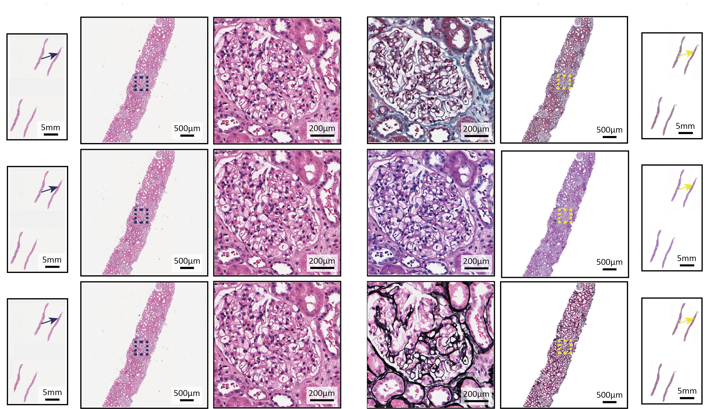
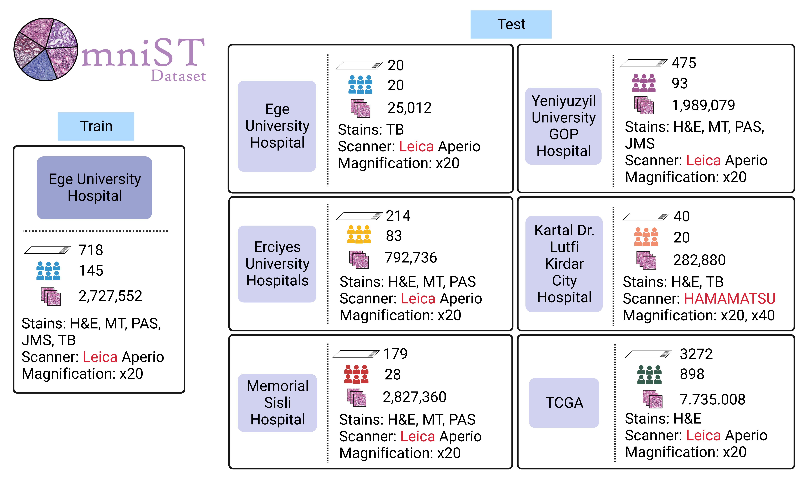

# Deep Learning-based Virtual Special Staining of H&E-Stained Tissue Sections
### [Arxiv](https://arxiv.org/abs/) | [Dataset](https://data.mendeley.com/datasets/x5bft3t993/draft?a=a198bbcc-ae3f-40ac-aea9-95c22536315e) | [WebSite](https://deepmia.boun.edu.tr/) 

 



We introduce a robust, efficient, and high-performing AI-XStainer tool designed to convert conventional H&E-stained WSIs Masson’s trichrome (MT), Periodic acid-Schiff (PAS), Jones methenamine silver (JMS), and Toluidine blue (TB) stained versions, both at the patch-level and slide-level. We also present our publicly available OmniST dataset consisting of patient-based H&E-stained tissue images and equivalent stained tissue images for MT (Kidney), PAS (Kidney), JMS (Kidney), MT (Liver), PAS (Liver), and TB (Stomach), collected from five different centers. 

\
*Workflow overview. A. Kidney, liver, or stomach biopsy specimen from patients are fixed with formalin and embedded in paraffin (FFPE). They are then stained with different stains to serve as training data for the network. B. Separate virtual staining networks are trained for each stain. WSIs of kidney, liver, and stomach tissues are first segmented, and then divided into smaller patches. Real H&E-stained patches obtained from kidney, liver, and stomach tissue samples are used as input for the virtual staining generator network. The generator network produces corresponding virtually stained patches as output. In the final step, the outputted virtually stained patches are stitched together to provide pathologists with a comprehensive view that allows for detailed examination of specific features, components, and entities to aid in the final diagnosis.*

#### Example stain transformation results
<p align="center">

</p>

## Prerequisites
- Linux or macOS
- Python 3
- CPU or NVIDIA GPU + CUDA CuDNN

### Getting started

- Clone this repo:
```bash
git clone https://github.com/DeepMIALab/AI-XStainer
cd AI-XStainer
```

- Install PyTorch 1.9 and other dependencies (e.g., torchvision, visdom, dominate, gputil).

- For pip users, please type the command `pip install -r requirements.txt`.

- For Conda users,  you can create a new Conda environment using `conda env create -f environment.yml`.

### Training and Test
The data used for training and testing are expected to be organized as follows:
```bash
Data_Path          
 ├──  trainA
 |      ├── 1.png     
 |      └── ...
 ├──  trainB     
 |      ├── 1.png     
 |      └── ...
 ├──  testA
 |      ├── 1.png     
 |      └──...
 └──  testB     
        ├── 1.png     
        └──...
    
```

- To view training results and loss plots, run `python -m visdom.server` and click the URL http://localhost:8097.

- To following command can be used to train the model:
```bash
python train.py --dataroot ./datasets/HE/${dataroot_train_dir_name} --name ${model_results_dir_name} --CUT_mode CUT --batch_size 1
```

- To following command can be used to test the model:
```bash
python test.py --dataroot ./datasets/HE/${dataroot_test_dir_name}  --name ${result_dir_name} --CUT_mode CUT --phase test --epoch ${epoch_number} --num_test ${number_of_test_images}
```
The test results will be saved to a html file here: ``` ./results/${result_dir_name}/latest_train/index.html ``` 


#### Transformation of H&E image into MT, PAS, and JMS patch and WSI images using virtual special staining in kidney tru-cut biopsy tissue sections
<p align="center">

</p>

#### Application of AI-XStainer tool with different test cohorts
<p align="center">

</p>

#### OmniST Dataset Collection
Tissue samples were collected from five different centers in Türkiye: Ege University Hospital, Yeni Yuzyil University Gaziosmanpasa (GOP) Hospital, Kartal Dr. Lutfi Kirdar Hospital, Erciyes University Hospitals, and Sisli Memorial Hospital, for the purpose of creating the OmniST dataset. The dataset comprises a total of 1598 whole slide images (WSIs) obtained from 429 biopsy cases collected between 2002 and 2022. The OmniST dataset represents a valuable collection of biopsy samples derived from renal, liver, and gastric tissues, which were utilized for virtual staining of different tissue types. The dataset includes a diverse range of biopsy samples, such as transplant kidney biopsies, transplant liver biopsies, and stomach biopsies after the detection of Helicobacter pylori infection. The kidney and liver cases were stained with H&E, MT, PAS, and JMS over the course of several years, reflecting routine clinical practice. For virtual TB staining, 40 tissue slices from Helicobacter pylori-positive gastric tissue specimens were collected and stained with H&E and TB at Yeni Yuzyil University Gaziosmanpasa (GOP) Hospital.

<p align="center">

</p>


